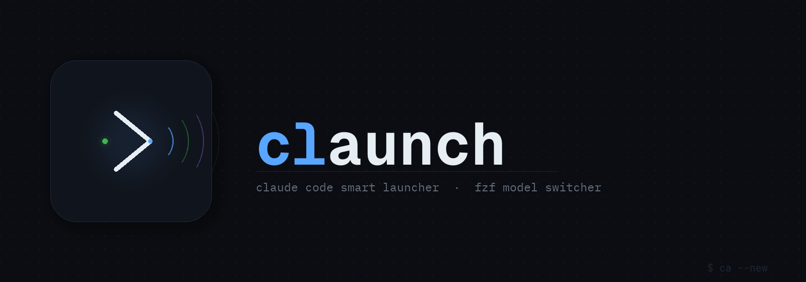

# claunch



Claude Code smart launcher with fzf model switcher.

**Run a different AI model in every terminal window — simultaneously, without conflicts.**  
One window on Claude Opus, another on MiniMax, another on DeepSeek. Each session is fully isolated.

[中文文档](README.zh.md)

---

## Why claunch

Most setups force you to pick one model globally. claunch lets you open multiple terminal windows, each running a different provider or model at the same time — no config files to swap, no environment leaking between sessions.

**How it works:** claunch injects model credentials as process-level environment variables (`env KEY=VAL claude ...`). Each terminal process has its own environment, so switching models in one window never affects another. Switch models per-window, per-task, per-context.

## Features

- **Per-window model isolation** — each terminal session runs its own model, completely independent
- `ca --new` — pick any model via fzf before launching
- `ca` — pure pass-through; launches Claude with its default model
- `ca --continue` / `ca --resume <id>` — resume sessions with the model/provider that conversation originally used (per-session record, or parsed from the session transcript)
- `ca --list` — browse models interactively: **Enter** launch, **e** edit, **Del** delete
- Model management: add, remove, edit models without touching JSON files
- Background version check — notifies when an upgrade is available
- Bilingual UI: English and Chinese (`ca --lang zh`)
- All `claude` flags pass through (e.g. `ca --continue`, `ca --resume <id>`)
- Restores terminal state (p10k, Starship, Pure, and other prompt frameworks) cleanly after exit

## Requirements

- [Claude Code](https://claude.ai/code) (`claude` CLI)
- [Homebrew](https://brew.sh/) (for auto-installing `jq` and `fzf`)
- zsh

## Install

```zsh
bash <(curl -fsSL https://raw.githubusercontent.com/k186/claunch/main/install.sh)
source ~/.zshrc
```

`jq` and `fzf` are installed automatically via Homebrew if missing.

Or clone and install locally:

```zsh
git clone https://github.com/k186/claunch ~/claunch
zsh ~/claunch/install.sh
source ~/.zshrc
```

## Usage

```zsh
ca                       # pass-through: launch Claude with its default model
ca --new                 # pick a model via fzf, then launch a new session
ca --continue            # resume the last session, restoring its model/provider
ca --resume <id>         # resume a specific session, restoring its model/provider
ca --resume              # open Claude's interactive resume picker (pass-through)
ca --new --resume <id>   # explicitly pick a model, then resume that session
```

All `claude` flags pass through verbatim after `ca`.

### How resume restores the model

Every launch records the conversation: after Claude exits, claunch detects the
session id (the newest transcript under `~/.claude/projects` written during the
run, preferring the current project) and reads the model that conversation
actually used from the transcript. Each conversation gets one small file:

```
~/.config/claunch/sessions/<session-id>.json  →  {"model":"<model string>"}
```

`ca --continue` and `ca --resume <id>` restore the model in this order:

1. saved session record (`sessions/<id>.json`);
2. the session transcript itself;
3. otherwise pure pass-through (Claude's own behavior).

The model string is matched against your `models.json` entries — by `name`,
`model`, or `env.ANTHROPIC_MODEL` — and the full env + `--model` are injected, so
the resumed session keeps the same provider and credentials. `ca` without flags
and `ca --resume` (picker) pass through untouched; the picker's choice is
recorded after the run for the next resume.

## Model management

```zsh
ca --list               # browse models (Enter=launch, e=edit, Del=delete)
ca --add                # add a new model (interactive wizard)
ca --remove             # remove a model (fzf picker)
ca --current            # show which model is active in this window
```

`ca --list` opens an interactive fzf panel with a live preview of each model's configuration. Press **Enter** to launch, **e** to edit, **Del** to delete (with confirmation).

## Other commands

```zsh
ca --update            # upgrade claunch (your model config is never overwritten)
ca --lang [en|zh]       # show or set the UI language
ca --help               # show all commands
```

claunch checks for updates in the background on every launch and prints a notice if a newer version is available.

## Configuration

claunch stores everything under `~/.config/claunch/`:

```
~/.config/claunch/
├── models.json     # model entries + last_model / last_session
└── sessions/       # one small JSON per conversation id (100 most recent kept)
```

`models.json` is created from `models.example.json` on first install and is never
overwritten by upgrades. The old location `~/.claude/models.json` is still
honored as a fallback, and `install.sh` migrates it automatically. Set
`CLAUNCH_MODELS_CFG` to use a different config path. You can also manage models
interactively with `ca --add`, `ca --remove`, and `ca --list`.

`last_session` tracks the most recent conversation id; `last_model` keeps the
most recently selected model for reference. Resume commands restore the recorded
model for that conversation, falling back to parsing the session transcript,
then pure pass-through.

```json
{
  "name": "claunch",
  "lang": "en",
  "last_model": "",
  "last_session": "",
  "models": [
    {
      "name": "Claude Opus 4.7",
      "model": "claude-opus-4-7",
      "env": {}
    },
    {
      "name": "MiniMax-M2.7",
      "model": "",
      "env": {
        "ANTHROPIC_BASE_URL": "https://api.minimaxi.com/anthropic",
        "ANTHROPIC_AUTH_TOKEN": "your-api-key",
        "CLAUDE_CODE_DISABLE_NONESSENTIAL_TRAFFIC": "1",
        "ANTHROPIC_MODEL": "MiniMax-M2.7"
      }
    },
    {
      "name": "DeepSeek V4 Pro (1M)",
      "model": "",
      "env": {
        "ANTHROPIC_BASE_URL": "https://api.deepseek.com/anthropic",
        "ANTHROPIC_AUTH_TOKEN": "your-api-key",
        "CLAUDE_CODE_DISABLE_NONESSENTIAL_TRAFFIC": "1",
        "CLAUDE_MAX_CONTEXT_WINDOW": "1000000",
        "ANTHROPIC_MODEL": "deepseek-v4-pro[1m]"
      }
    }
  ]
}
```

**Field reference:**

| Field | Description |
|-------|-------------|
| `name` | Display name shown in fzf |
| `model` | Passed as `--model` to claude. Leave `""` to use the provider's default via env vars |
| `env` | Environment variables injected per-session (API keys, base URLs, etc.) |

**For third-party providers** (MiniMax, DeepSeek, etc.), set:
- `ANTHROPIC_BASE_URL` — provider's Anthropic-compatible API endpoint
- `ANTHROPIC_AUTH_TOKEN` — your API key
- `ANTHROPIC_MODEL` — model name as the provider expects it
- `CLAUDE_MAX_CONTEXT_WINDOW` — optional, e.g. `"1000000"` for 1M context
- `CLAUDE_CODE_DISABLE_NONESSENTIAL_TRAFFIC` — set to `"1"` for third-party providers

## License

MIT
