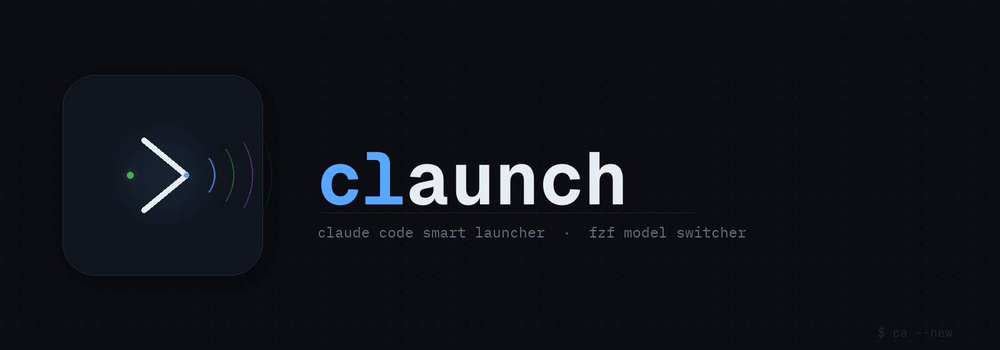
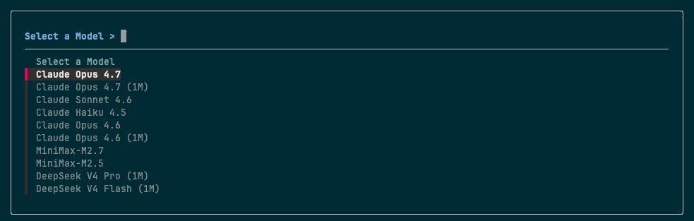

# claunch



支持 fzf 模型切换的 Claude Code 智能启动器。

**每个终端窗口运行不同的 AI 模型 — 同时并行，互不干扰。**  
一个窗口用 Claude Opus，另一个用 MiniMax，再开一个用 DeepSeek，完全隔离。

[English](README.md)

---

## 为什么用 claunch

通常你只能全局设置一个模型。claunch 让你同时打开多个终端窗口，每个窗口运行不同的服务商或模型 —— 无需手动切换配置，环境变量不会在窗口间泄漏。按窗口、按任务、按场景自由选模型。

## 功能

- **窗口级模型隔离** — 每个终端会话独立运行各自的模型，完全不冲突
- `ca --new` — 启动前通过 fzf 选择任意模型
- `ca` — 使用当前窗口上次选择的模型启动
- 所有 `claude` 参数透传（如 `ca --continue`、`ca --resume <id>`）
- 退出后自动恢复终端状态，兼容 p10k、Starship 等 prompt 框架



## 依赖

- [Claude Code](https://claude.ai/code)（`claude` CLI）
- [Homebrew](https://brew.sh/)（用于自动安装 `jq` 和 `fzf`）
- zsh

## 安装

```zsh
bash <(curl -fsSL https://raw.githubusercontent.com/k186/claunch/main/install.sh)
source ~/.zshrc
```

若缺少 `jq` 或 `fzf`，安装脚本会自动通过 Homebrew 安装。

或手动克隆安装：

```zsh
git clone https://github.com/k186/claunch ~/github/claunch
zsh ~/github/claunch/install.sh
source ~/.zshrc
```

## 配置

首次安装时会从 `models.example.json` 生成 `~/.claude/models.json`，编辑该文件填入 API Key 和模型：

```json
{
  "models": [
    {
      "name": "Claude Opus 4.7",
      "model": "claude-opus-4-7",
      "env": {}
    },
    {
      "name": "MiniMax-M2.7",
      "model": "",
      "env": {
        "ANTHROPIC_BASE_URL": "https://api.minimaxi.com/anthropic",
        "ANTHROPIC_AUTH_TOKEN": "your-api-key",
        "CLAUDE_CODE_DISABLE_NONESSENTIAL_TRAFFIC": "1",
        "ANTHROPIC_MODEL": "MiniMax-M2.7"
      }
    }
  ]
}
```

- `model` — 作为 `--model` 参数传给 claude，留空 `""` 则完全由环境变量驱动。
- `env` — 启动 claude 时注入的环境变量（API Key、Base URL 等）。

接入第三方服务商时，需设置 `ANTHROPIC_BASE_URL`、`ANTHROPIC_AUTH_TOKEN` 和 `ANTHROPIC_MODEL`。可用 `CLAUDE_MAX_CONTEXT_WINDOW` 覆盖上下文长度（如 `"1000000"` 表示 1M）。

## 用法

```zsh
ca                      # 使用当前模型启动
ca --new                # fzf 选择模型后启动
ca --continue           # 继续上次会话
ca --new --resume <id>  # 选择模型并恢复指定会话
```

## 模型管理

```zsh
ca --list               # 查看所有已配置的模型
ca --add                # 交互式添加新模型
ca --remove             # 通过 fzf 删除模型
ca --current            # 查看当前窗口使用的模型
ca --upgrade            # 升级 claunch 到最新版本
```

每次启动时 claunch 会在后台静默检测新版本，有更新时会在终端提示。`ca --upgrade` 只更新 `claunch.sh`，不会修改你的 `models.json`。
